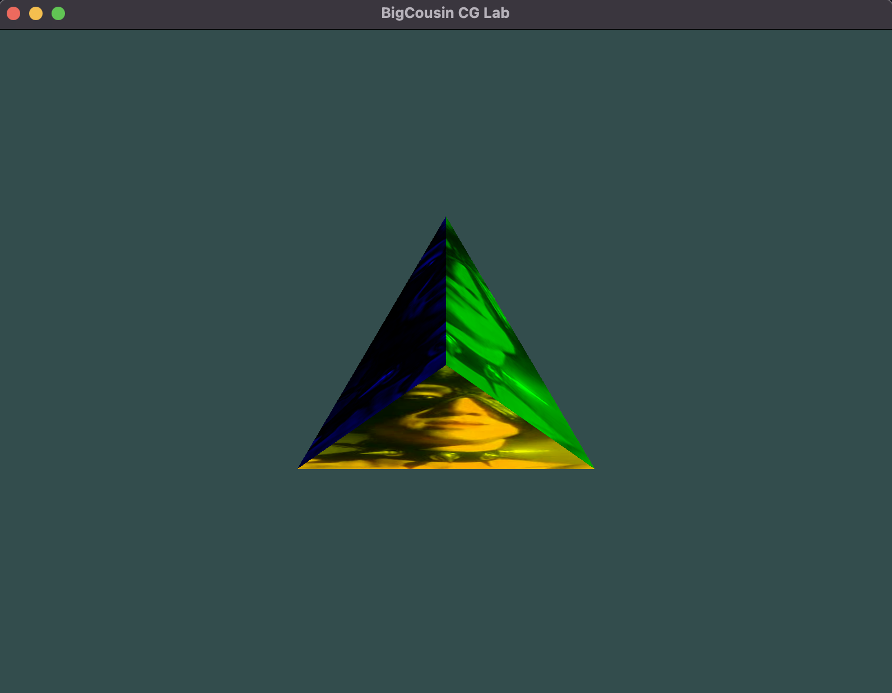

# CG Lab2

---

姓名：刘尚
学号：202211010058
代码仓库：[Github](https://github.com/van-artist/cg_2025spring_labs)

---

## 环境配置

### 系统环境

- MacOS
- 处理器架构：ARM64（Apple Silicon）
- 编译器: Clang（Apple Clang 15.0.0）

### GLM 配置

项目整体配置沿用实验一的配置，项目的修改在是在实验一的基础上进行的。
只需要额外进行`GLM`的配置即可。

我们使用 MacOS 的`brew`包管理器进行`GLM`的安装。

```shell
brew install glm
```

确认`GLM`的安装是否成功。


```shell
brew info glm
```

确认`GLM`安装成功后，我们可以在`CMakeLists.txt`中添加`GLM`的配置。

以下是`CMakeLists.txt`中`GLM`的配置。

```cmake
include_directories(/opt/homebrew/include)
```

说明：`/opt/homebrew/include`是`brew`安装`GLM`的默认路径，同时也是`GLM`的头文件路径。

## ``GLM`的使用

再进一步实验之前，我们有必要简单了解一下`GLM`的使用。

主要是`GLM`的基本数据结构和使用方法，尤其是各种线性代数的操作。

### 基本数据结构

- `vec2`：二维向量
- `vec3`：三维向量
- `vec4`：四维向量
- `mat2`：二维矩阵
- `mat3`：三维矩阵
- `mat4`：四维矩阵

### 基本操作

- 矩阵与向量的加减乘除等基本运算
- 各种几何线性变换
  - 旋转：`glm::rotate`
  - 缩放：`glm::scale`
  - 平移：`glm::translate`
  - 投影：`glm::perspective`

## 任务实现

> 接下来先观察每个任务的要求，分析实现思路，最后给出最终实现全部任务后的代码讲解。

- 任务 1：在实验一中任务 2/3 的基础上，对于带颜色或纹理的自定义立方体，通过旋转操作展示其三视图（主视图、俯视图、左视图）
- 任务 2：在任务 1 的基础上，展示有透视投影效果的立方体三视图
- 任务 3：在任务 2 的基础上，增加深度测试，展示更具有真实感的立方体三视图

### 任务 1

根据 LearnOpenGL 中的教程，我们可以通过旋转操作展示立方体的三视图。
这分为两个任务：

- 计算出三种旋转操作的旋转矩阵
- 在渲染循环中，分别应用这三种旋转矩阵

#### 计算旋转矩阵

对我们的模型进行各种变换基于各种线性变换，包括下面的方面

- 模型本身的变换
- 摄像机的变换
- 透视投影的变换

计算旋转矩阵主要通过`glm::rotate`函数实现，作用于一个单位矩阵上。
我们通过先声明一个单位矩阵`model`，表示对模型本身的所有变换。
声明一个单位矩阵`view`，表示摄像机的变换。
声明一个单位矩阵`projection`，表示透视投影的变换。

任务一我们主要是对模型本身的变换，所以我们只需要计算模型的旋转矩阵即可。

```cpp
glm::mat4 model = glm::mat4(1.0f);
model = glm::scale(model, glm::vec3(1.1, 1.1, 1.1));
```

如果要展示主视图，不需要进行旋转，直接渲染就行，可以省略这一步。

如果要展示俯视图，需要绕 x 轴旋转 90 度。

```cpp
model = glm::rotate(model, glm::radians(90.0f), glm::vec3(1.0f, 0.0f, 0.0f));
```


如果要展示左视图，需要绕 y 轴旋转 90 度。

```cpp
model = glm::rotate(model, glm::radians(90.0f), glm::vec3(0.0f, 1.0f, 0.0f));
```


#### 应用旋转矩阵

在渲染循环中，我们需要分别应用这三种旋转矩阵。那么如何实现呢？
主要思路是把三种旋转矩阵发送给顶点着色器，然后再着色器中应用即可，这里的直接通过`uniform`变量传递。

```cpp
glUniformMatrix4fv(transformLoc, 1, GL_FALSE, glm::value_ptr(trans));
```

然后我们继续改进实验一里的顶点着色器，增加一个`uniform`变量，用于接收旋转矩阵。

```glsl
#version 330 core
layout (location = 0) in vec3 aPos;
layout (location = 1) in vec3 aColor;
layout (location = 2) in vec2 aTexCoord;


flat out vec3 faceColor;
out vec2 texCoord;
uniform mat4 transform;


void main() {
    gl_Position = transform * vec4(aPos, 1.0f);
    faceColor = aColor;
    texCoord = aTexCoord;

}
```

### 任务 2

在 3D 渲染中，透视投影（Perspective Projection）通过视锥体（Frustum）来定义一个可视区域，物体会随着距离的增加而缩小，模拟真实世界的透视效果。

透视投影由以下四个参数控制：

- **fovy（视场角，Field of View, FOV）**：

  - 控制相机的垂直视角，单位是弧度。
  - 例如，45° 视角表示较为常见的广角视野。

- **aspect（宽高比，Aspect Ratio）**：

  - 计算方式：`aspect = 窗口宽度 / 窗口高度`
  - 作用：防止物体变形（避免拉伸或压缩）。

- **zNear（近裁剪面，Near Plane）**：

  - 定义最靠近相机的可见距离，小于 zNear 的物体不会被渲染。

- **zFar（远裁剪面，Far Plane）**：
  - 定义最远的可见距离，超过 zFar 的物体会被裁剪。
    在任务 1 的基础上，我们需要展示有透视投影效果的立方体三视图。
    根据课程内容以及 LearnOpenGL 的教程，我们可以通过`glm::perspective`函数实现透视投影。
    本质是通过透视投影矩阵将立方体的三视图投影到屏幕上,再添加一层线性变换。

透视投影矩阵的计算公式：

```cpp
glm::mat4 projection = glm::perspective(glm::radians(45.0f), (float)SCR_WIDTH / (float)SCR_HEIGHT, 0.1f, 100.0f);
```

`glm::radians(45.0f)`: 转换 45° 视角 为弧度。

`(float)SCR_WIDTH / (float)SCR_HEIGHT`: 计算窗口的宽高比，防止图像变形。

`0.1f, 100.0f`: 设置 近裁剪面（0.1）和远裁剪面（100）。

### 任务 3

根据 LearnOpenGL 的教程，我们可以通过深度测试来展示更具有真实感的立方体三视图。
只需在渲染循环中启用深度测试即可。

```cpp
glEnable(GL_DEPTH_TEST);
```

当启用了 `GL_DEPTH_TEST`，OpenGL 在渲染每个像素时会进行以下流程：

- 获取片段的深度值（Z 值）。

- 读取当前深度缓冲区中存储的深度值。

- 使用 `glDepthFunc()` 设定的规则进行比较：

- 如果通过深度测试：

  - 更新该像素的颜色（Color Buffer）。

  - 更新该像素的深度值（Depth Buffer）。

- 如果不通过深度测试：

  - 丢弃该像素，不修改颜色和深度缓冲区。

### 效果展示

完整的代码见代码仓库的`archive/lab2.cpp`

三视图效果如下

### 让模型动起来

如果在旋转操作的基础上，通过时间来计算旋转角度，就可以实现动态旋转的效果。

把主渲染循环改成如下形式：

```cpp
while (!glfwWindowShouldClose(window))
{
    processInput(window);
    glClearColor(0.2f, 0.3f, 0.3f, 1.0f);

    glClear(GL_COLOR_BUFFER_BIT | GL_DEPTH_BUFFER_BIT);

    float timeValue = glfwGetTime();
    float angle = timeValue * glm::radians(50.0f);

    glm::mat4 model = glm::mat4(1.0f);
    model = glm::rotate(model, angle, glm::vec3(0.0f, 1.0f, 0.0f));
    model = glm::scale(model, glm::vec3(1.1, 1.1, 1.1));

    glm::mat4 view = glm::lookAt(
        glm::vec3(0.0f, 0.0f, 3.0f),
        glm::vec3(0.0f, 0.0f, 0.0f),
        glm::vec3(0.0f, 1.0f, 0.0f));

    glm::mat4 projection = glm::perspective(glm::radians(45.0f), (float)SCR_WIDTH / (float)SCR_HEIGHT, 0.1f, 100.0f);

    glm::mat4 trans = projection * view * model;

    shaderLoader.use();
    glUniformMatrix4fv(transformLoc, 1, GL_FALSE, glm::value_ptr(trans));

    glActiveTexture(GL_TEXTURE0);
    glBindTexture(GL_TEXTURE_2D, texture);
    glUniform1i(glGetUniformLocation(shaderProgram, "ourTexture"), 0);

    glBindVertexArray(VAO);
    glDrawArrays(GL_TRIANGLES, 0, 12);
    glBindVertexArray(0);

    glfwSwapBuffers(window);
    glfwPollEvents();
}

```

下面是视频效果展示
<video controls src="./videos/lab2_1.mov" title="Title" style="max-width: 600px;"></video>

相关代码见代码仓库的`src/main.cpp`

## 实验总结

在本次实验中，我们深入研究了 GLM（OpenGL Mathematics）的使用，并结合 OpenGL 实现了立方体的三视图展示。实验过程中，我们从基本数学变换到 3D 透视投影，再到深度测试的应用，逐步构建了一个更完整的 3D 渲染流程。以下是本次实验的总结：

1. **GLM 线性代数操作**

   - 学习了 GLM 的基本数据结构（vec 和 mat 类型）。
   - 了解了 GLM 提供的线性变换函数，如：
     - 旋转（`glm::rotate`）
     - 缩放（`glm::scale`）
     - 平移（`glm::translate`）
     - 投影（`glm::perspective`）

2. **变换矩阵的作用**

   - **模型变换（Model Matrix）**：定义物体的旋转、缩放、平移，用于调整物体在 3D 空间中的位置。
   - **观察变换（View Matrix）**：模拟摄像机的视角，决定我们从哪个角度观察场景。
   - **投影变换（Projection Matrix）**：将 3D 场景映射到 2D 屏幕，包含透视投影（Perspective Projection）和正交投影（Orthographic Projection）。

3. **深度测试的实现**
   - 通过 `glEnable(GL_DEPTH_TEST)` 启用深度测试，保证遮挡关系正确，防止后绘制的物体错误覆盖前面物体。
   - 了解了深度缓冲区（Depth Buffer）的作用：
     - 清除缓冲区（`glClear(GL_DEPTH_BUFFER_BIT)`）
