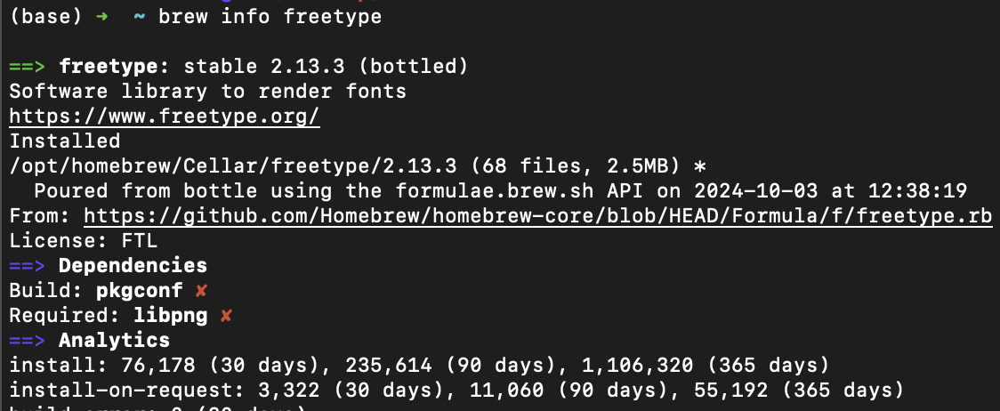
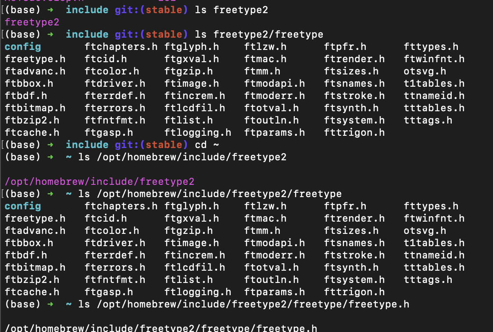
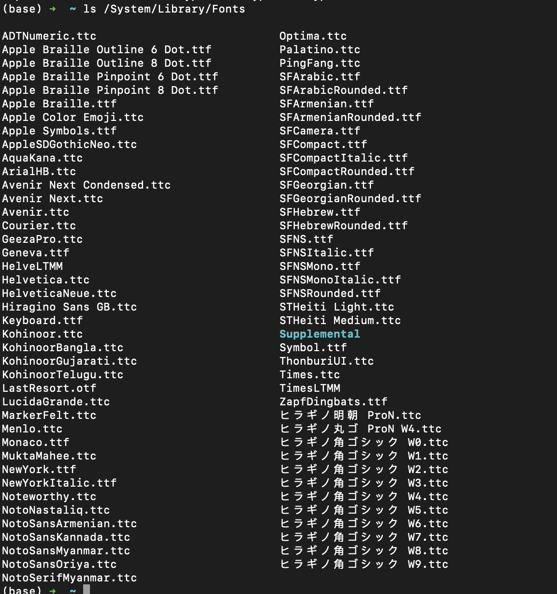
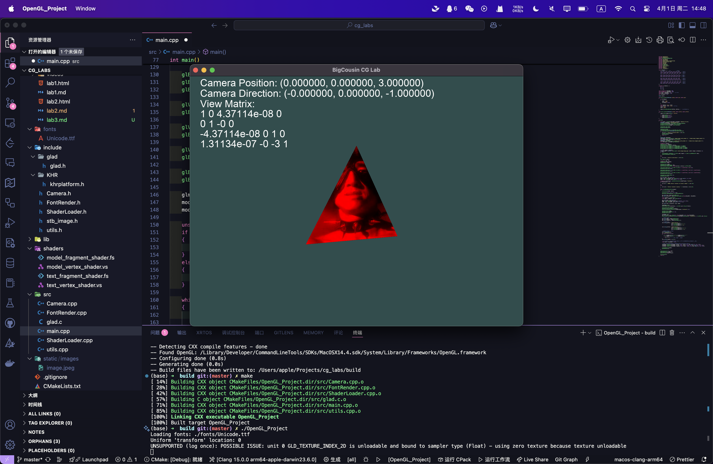

# CG Lab3

---

姓名：刘尚
学号：202211010058
代码仓库：[Github](https://github.com/van-artist/cg_2025spring_labs)

---

## 环境配置

### 系统环境

- MacOS
- 处理器架构：ARM64（Apple Silicon）
- 编译器: Clang（Apple Clang 15.0.0）

### FreeType 配置

项目整体配置沿用实验一/二的配置，项目的修改在是在实验一/二的基础上进行的。

只需要额外进行`FreeType`的配置即可。
我们使用 MacOS 的`brew`包管理器进行`FreeType`的安装。

```shell
brew install freetype
```

确认`FreeType`的安装是否成功。

```shell
brew info freetype
```



再查看 include 目录下的`freetype2`文件夹。

```shell
ls /opt/homebrew/include/freetype2
```

```shell
ls /opt/homebrew/include/freetype2/freetype
```

发现`freetype`的头文件也存在。

```shell
ls /opt/homebrew/include/freetype2/freetype/freetype.h
```



发现`freetype`的头文件存在诡异的嵌套。
对此我们需要注意其头文件路径即可

确认`FreeType`安装成功后，我们可以在`CMakeLists.txt`中添加`FreeType`的配置。

```cmake
cmake_minimum_required(VERSION 3.10)
project(OpenGL_Project)

set(CMAKE_CXX_STANDARD 17)
set(FREETYPE_INCLUDE_DIRS "/opt/homebrew/opt/freetype/include/freetype2")
set(FREETYPE_LIBRARIES "/opt/homebrew/opt/freetype/lib/libfreetype.dylib")

# 查找 OpenGL
find_package(OpenGL REQUIRED)


# 添加 glad、GLEW、GLFW 头文件路径
include_directories(${PROJECT_SOURCE_DIR}/include)
include_directories(/opt/homebrew/include)
include_directories(${FREETYPE_INCLUDE_DIRS})
link_directories(/opt/homebrew/lib)

file(GLOB SOURCES ${PROJECT_SOURCE_DIR}/src/*.cpp ${PROJECT_SOURCE_DIR}/src/glad.c)
add_definitions(-DGL_SILENCE_DEPRECATION)


# 生成可执行文件
add_executable(OpenGL_Project ${SOURCES})
add_custom_command(TARGET OpenGL_Project POST_BUILD
    COMMAND ${CMAKE_COMMAND} -E copy_directory
    ${PROJECT_SOURCE_DIR}/shaders $<TARGET_FILE_DIR:OpenGL_Project>/shaders
)


# 链接 OpenGL、GLEW、GLFW
target_link_libraries(OpenGL_Project OpenGL::GL GLEW glfw ${FREETYPE_LIBRARIES})

```

这里我们不仅添加了`FreeType`的头文件路径，还添加了`FreeType`的库文件路径。取保链接时不会出错。

## 任务实现

> 接下来先观察每个任务的要求，分析实现思路，最后给出最终实现全部任务后的代码讲解。

- 任务 1:在实验二中任务 3 的基础上，对于设置深度测试的自定义立方体，设置不同的相机位置、方向、坐标系(至少 3 个不同的相机)观察物体;
- 任务 2:在任务 1 的基础上，使用键盘与鼠标控制摄像机参数，其中 WSAD 分别控制摄像机前后与左右平移，鼠标控制摄像机方向;
- 任务 3:在任务 2 的基础上，在屏幕上显示当前摄像机位置、方向、坐标系矩阵的文本。
- 可选:自定义摄像机类控制摄像机

### 任务 1

任务 1：设置多个不同的摄像机视角
在 OpenGL 中，相机本质上是通过**视图矩阵（View Matrix）**控制观察方向的。我们可以使用 glm::lookAt() 来生成视图矩阵：

```cpp
glm::mat4 view = glm::lookAt(cameraPos, cameraTarget, up);
```

那么我们只需要设置不同的相机位置、方向和坐标系即可。
例如

```cpp
cameraPos = glm::vec3(0.0f, 5.0f, 0.0f);
cameraTarget = glm::vec3(0.0f, 0.0f, 0.0f);
up = glm::vec3(0.0f, 0.0f, -1.0f);
```

```cpp
cameraPos = glm::vec3(5.0f, 0.0f, 0.0f);
cameraTarget = glm::vec3(0.0f, 0.0f, 0.0f);
up = glm::vec3(0.0f, 1.0f, 0.0f);
```

```cpp
cameraPos = glm::vec3(3.0f, 3.0f, 3.0f);
cameraTarget = glm::vec3(0.0f, 0.0f, 0.0f);
up = glm::vec3(0.0f, 1.0f, 0.0f);
```

此外，通过开启深度测试（glEnable(GL_DEPTH_TEST)），确保三角面片正确进行前后遮挡判断。

由于这个静态的任务相当于任务 3 的“子集”，我们可以先封装好一个`Camera`类，后续的任务都可以使用这个类来进行相机的控制。如果实现了视角的自由移动和控制，就可以完成这个任务的效果。

### 任务 2

为实现动态交互的视角控制，本任务中加入了用户输入控制的自由相机，具体包括：1. 键盘控制移动（WSAD）
通过监听 GLFW 键盘事件，调用自定义 Camera 类中的 processKeyboardInput() 方法，实现前后左右移动。其原理是将移动方向投影到相机前向与右向的组合上：

```cpp
if (key == GLFW_KEY_W) position += speed * front;
if (key == GLFW_KEY_A) position -= speed * right;
```

其中 right 是通过 glm::normalize(glm::cross(front, up)) 计算得到的。

2. 鼠标控制视角旋转
   GLFW 鼠标回调函数中获取当前鼠标位置变化，计算 yaw（偏航）和 pitch（俯仰）角的变化，进而更新 front 向量：

```cpp
front.x = cos(glm::radians(pitch)) * cos(glm::radians(yaw));
front.y = sin(glm::radians(pitch));
front.z = cos(glm::radians(pitch)) * sin(glm::radians(yaw));
```

摄像机方向实时变化，视角也随之动态调整。

3. 滚轮控制视野范围（FOV）
   通过 glfwSetScrollCallback 注册滚轮回调，在滚动时改变 fov 变量，实现视角缩放：

```cpp
camera.setFov(camera.getFov() - yoffset);
```

最终在透视矩阵生成时动态传入 fov：

```cpp
glm::perspective(glm::radians(fov), aspectRatio, 0.1f, 100.0f);
```

#### 个人观察与总结

在本任务的实验过程中，我注意到 OpenGL 处理鼠标和键盘输入的机制有所不同：

鼠标事件 是通过 GLFW 的事件机制异步触发的，即当鼠标移动时会主动调用注册的回调函数；

键盘输入 则通常在每一帧渲染循环中通过 glfwGetKey() 轮询检测并手动处理；

这种差异意味着，键盘输入的处理频率取决于渲染帧率，而鼠标输入则是事件驱动的。这也解释了为什么在处理鼠标偏移时要用 firstMouse 标志记录初始状态，以防止初始化跳变。

### 任务 3

本任务的核心是使用 FreeType 实现屏幕文字渲染，并将摄像机状态以文字形式输出在屏幕上。

#### 实现步骤

1. **初始化 FreeType 字体库**

   - 使用 `FT_Init_FreeType` 初始化字体库。
   - 加载指定的 `.ttf` 字体文件。
   - 调用 `FT_Load_Char` 获取每个字符的位图信息，并将其转化为 OpenGL 可用的纹理。

2. **加载字符纹理**

   - 为 ASCII 范围内的每个字符预生成纹理。
   - 保存字符的尺寸、偏移、步进信息，供后续渲染时使用。

3. **使用正交投影渲染文本**

   - 构建一个正交投影矩阵，将文字固定在屏幕上。
   - 使用专门的文字着色器进行渲染：
     - 顶点着色器：通过 `projection * vec4(vertex.xy, 0.0, 1.0)` 将像素坐标转为 NDC（Normalized Device Coordinates）。
     - 片段着色器：使用灰度通道作为 alpha 值，实现透明文字渲染。
   - 字体纹理使用 `GL_RED` 格式加载，结合 `textColor` 输出目标颜色。

4. **输出摄像机信息**
   - 在主循环中实时获取当前摄像机状态。
   - 将摄像机状态格式化为字符串，传入渲染函数进行绘制。
   - 使用 `glUniformMatrix4fv` 将摄像机矩阵传递给着色器，确保文字渲染在正确的位置。

说明：
其中加载字体库，我们可以直接复制我 MacOS 下的字体文件到项目中，或者直接使用系统字体库中的字体文件。
在 MacOS 下，字体文件一般在 `/System/Library/Fonts` 目录下。

```shell
ls /System/Library/Fonts
```



在这里我们使用的是`Unicode.ttc`字体文件，移动到`fonts`目录下即可。

```shell
cp /System/Library/Fonts/Unicode.ttf ./fonts
```

为了构建时相对路径不会出错，我们在 Cmake 流程中补充拷贝字体的操作

```cmake
add_custom_command(TARGET OpenGL_Project POST_BUILD
    COMMAND ${CMAKE_COMMAND} -E copy_directory
    ${PROJECT_SOURCE_DIR}/fonts $<TARGET_FILE_DIR:OpenGL_Project>/fonts
)
```

## 代码实现

分析完任务要求并且了解实现思路后，我们可以开始实现代码了。

我们要在实验二的基础上修改代码，大概分为以下几个部分：

- `Camera`类的实现
- `FontRender`类的实现
- 新的字体着色器的实现
- 主函数的完善

### Camera 类

`Camera`类的实现主要是对相机的封装，提供一些基本的操作函数。

```cpp
class Camera
{
private:
    glm::vec3 position;
    glm::vec3 front;
    glm::vec3 up;
    float yaw;
    float pitch;
    bool firstMouse;

    float speed;
    float sensitivity;
    float fov;

public:
    Camera(glm::vec3 startPosition = glm::vec3(0.0f, 0.0f, 3.0f),
           glm::vec3 startFront = glm::vec3(0.0f, 0.0f, -1.0f),
           glm::vec3 startUp = glm::vec3(0.0f, 1.0f, 0.0f),
           float startYaw = -90.0f, float startPitch = 0.0f, float startSpeed = 0.05f,
           float startSensitivity = 0.1f, float startFov = 45.0f, bool firstMouse = false)
        : position(startPosition), front(startFront), up(startUp), yaw(startYaw), pitch(startPitch),
          speed(startSpeed), sensitivity(startSensitivity), fov(startFov), firstMouse(firstMouse) {}

    float getSpeed() const { return speed; }
    void setSpeed(float newSpeed) { speed = newSpeed; }

    float getSensitivity() const { return sensitivity; }
    void setSensitivity(float newSensitivity) { sensitivity = newSensitivity; }

    float getFov() const { return fov; }
    void setFov(float newFov) { fov = newFov; }

    glm::vec3 getPosition() const { return position; }
    glm::vec3 getFront() const { return front; }
    glm::vec3 getUp() const { return up; }

    float getYaw() const { return yaw; }
    float getPitch() const { return pitch; }

    void processMouseMovement(float xOffset, float yOffset);
    void processKeyboardInput(int key);

    glm::mat4 getViewMatrix() const;
    glm::mat4 getProjectionMatrix(float aspectRatio) const;
};
```

这个`Camera`类封装了相机的位置、方向、速度、灵敏度等参数，并提供了一些基本的操作函数。
我们可以通过`processMouseMovement`函数来处理鼠标的偏移量，通过`processKeyboardInput`函数来处理键盘的输入。

```cpp
void Camera::processMouseMovement(float xOffset, float yOffset)
{
    xOffset *= sensitivity;
    yOffset *= sensitivity;

    yaw += xOffset;
    pitch += yOffset;

    if (pitch > 89.0f)
        pitch = 89.0f;
    if (pitch < -89.0f)
        pitch = -89.0f;

    glm::vec3 front;
    front.x = cos(glm::radians(pitch)) * cos(glm::radians(yaw));
    front.y = sin(glm::radians(pitch));
    front.z = cos(glm::radians(pitch)) * sin(glm::radians(yaw));
    this->front = glm::normalize(front);
}

void Camera::processKeyboardInput(int key)
{
    float velocity = speed;
    if (key == GLFW_KEY_W)
        position += velocity * front;
    if (key == GLFW_KEY_S)
        position -= velocity * front;
    if (key == GLFW_KEY_A)
        position -= glm::normalize(glm::cross(front, up)) * velocity;
    if (key == GLFW_KEY_D)
        position += glm::normalize(glm::cross(front, up)) * velocity;
}
```

在使用这个类时，我们只需要在主函数中创建一个全局的`Camera`对象，然后在之前写的处理鼠标和键盘输入的函数中添加调用这个对象方法的逻辑即可处理键盘输入。

```cpp
void processInput(GLFWwindow *window, Camera &camera)
{
    if (glfwGetKey(window, GLFW_KEY_ESCAPE) == GLFW_PRESS)
        glfwSetWindowShouldClose(window, true);
    if (glfwGetKey(window, GLFW_KEY_W) == GLFW_PRESS)
        camera.processKeyboardInput(GLFW_KEY_W);
    if (glfwGetKey(window, GLFW_KEY_S) == GLFW_PRESS)
        camera.processKeyboardInput(GLFW_KEY_S);
    if (glfwGetKey(window, GLFW_KEY_A) == GLFW_PRESS)
        camera.processKeyboardInput(GLFW_KEY_A);
    if (glfwGetKey(window, GLFW_KEY_D) == GLFW_PRESS)
        camera.processKeyboardInput(GLFW_KEY_D);
}
```

在鼠标回调函数中，我们也需要添加对`Camera`对象的调用。

```cpp
void mouse_callback(GLFWwindow *window, double xpos, double ypos)
{
    if (firstMouse)
    {
        lastX = xpos;
        lastY = ypos;
        firstMouse = false;
    }

    float xOffset = xpos - lastX;
    float yOffset = lastY - ypos; // y轴反向
    lastX = xpos;
    lastY = ypos;

    camera.processMouseMovement(xOffset, yOffset); // 传递偏移量给摄像机
}

void scroll_callback(GLFWwindow *window, double xoffset, double yoffset)
{
    camera.setFov(camera.getFov() - yoffset);

    if (camera.getFov() < 1.0f)
        camera.setFov(1.0f);
    if (camera.getFov() > 45.0f)
        camera.setFov(45.0f);
}
```

注册鼠标回调函数时，我们需要传递`Camera`对象的引用。

```cpp
glfwSetCursorPosCallback(window, mouse_callback);
glfwSetScrollCallback(window, scroll_callback);
```

### FontRender 类与文本渲染着色器

`FontRender`类的实现主要是对字体渲染的封装，提供一些基本的操作函数。

参考 LearnOpenGL 的[Text Rendering](https://learnopengl.com/In-Practice/Text-Rendering)实现。

```cpp
struct Character
{
    GLuint TextureID;   // 字形纹理的ID
    glm::ivec2 Size;    // 字形大小
    glm::ivec2 Bearing; // 从基准线到字形左部/顶部的偏移值
    FT_Pos Advance;     // 原点距下一个字形原点的距离
};
using Characters = std::map<GLchar, Character>;

class FontRender
{
private:
    Characters characters;
    GLuint textVAO, textVBO;

public:
    FontRender(const std::string ttsPath, FT_UInt font_size = 48);
    GLuint getCharacterTexture(GLchar c);
    void renderText(ShaderLoader &shader, std::string text, float x, float y, float scale, glm::vec3 color);

    ~FontRender();
};
```

`FontRender`类的构造函数中，我们需要加载字体文件，并且生成每个字符的纹理。
同样为了简单起见，我们只处理 ASCII 字符集中前 128 个字符。

```cpp
FontRender::FontRender(const std::string ttsPath, FT_UInt font_size)
{
    if (!std::filesystem::exists(ttsPath))
    {
        std::cerr << "Font path does not exist: " << ttsPath << std::endl;
        std::exit(EXIT_FAILURE);
    }
    std::cout << "Loading fonts: " << ttsPath << std::endl;
    FT_Library ft;
    if (FT_Init_FreeType(&ft))
    {
        std::cerr << "ERROR::FREETYPE: Could not init FreeType Library" << std::endl;
        std::exit(EXIT_FAILURE);
    }

    FT_Face face;
    if (FT_New_Face(ft, ttsPath.c_str(), 0, &face))
    {
        std::cerr << "ERROR::FREETYPE: Failed to load font" << std::endl;
        std::exit(EXIT_FAILURE);
    }

    FT_Set_Pixel_Sizes(face, 0, font_size);

    glPixelStorei(GL_UNPACK_ALIGNMENT, 1); // 禁用字节对齐限制
    for (GLubyte c = 0; c < 128; c++)
    {
        // 加载字符的字形
        if (FT_Load_Char(face, c, FT_LOAD_RENDER))
        {
            std::cout << "ERROR::FREETYTPE: Failed to load Glyph" << std::endl;
            continue;
        }
        // 生成纹理
        GLuint texture;
        glGenTextures(1, &texture);
        glBindTexture(GL_TEXTURE_2D, texture);
        glTexImage2D(
            GL_TEXTURE_2D,
            0,
            GL_RED,
            face->glyph->bitmap.width,
            face->glyph->bitmap.rows,
            0,
            GL_RED,
            GL_UNSIGNED_BYTE,
            face->glyph->bitmap.buffer);

        glTexParameteri(GL_TEXTURE_2D, GL_TEXTURE_WRAP_S, GL_CLAMP_TO_EDGE);
        glTexParameteri(GL_TEXTURE_2D, GL_TEXTURE_WRAP_T, GL_CLAMP_TO_EDGE);
        glTexParameteri(GL_TEXTURE_2D, GL_TEXTURE_MIN_FILTER, GL_LINEAR);
        glTexParameteri(GL_TEXTURE_2D, GL_TEXTURE_MAG_FILTER, GL_LINEAR);

        Character character = {
            texture,
            glm::ivec2(face->glyph->bitmap.width, face->glyph->bitmap.rows),
            glm::ivec2(face->glyph->bitmap_left, face->glyph->bitmap_top),
            face->glyph->advance.x};
        characters.insert(std::pair<GLchar, Character>(c, character));
    }
    // 清理 FreeType 资源
    FT_Done_Face(face);
    FT_Done_FreeType(ft);

    glGenVertexArrays(1, &textVAO);
    glGenBuffers(1, &textVBO);
    glBindVertexArray(textVAO);
    glBindBuffer(GL_ARRAY_BUFFER, textVBO);
    glBufferData(GL_ARRAY_BUFFER, sizeof(float) * 6 * 4, nullptr, GL_DYNAMIC_DRAW);

    glEnableVertexAttribArray(0);
    glVertexAttribPointer(0, 4, GL_FLOAT, GL_FALSE, 4 * sizeof(float), 0);
    glBindBuffer(GL_ARRAY_BUFFER, 0);
    glBindVertexArray(0);
}
```

在`FontRender`类中，我们使用`std::map`来存储每个字符的纹理信息，并且在构造函数中加载字体文件，生成每个字符的纹理。

```cpp
GLuint FontRender::getCharacterTexture(GLchar c)
{
    auto it = characters.find(c);
    if (it != characters.end())
    {
        return it->second.TextureID;
    }
    else
    {
        std::cerr << "ERROR::FONTRENDER: Character not found: " << c << std::endl;
        return 0;
    }
}
```

我们现在需要再封装一个`renderText` 方法用于渲染文本，使用`glDrawArrays`函数绘制每个字符的纹理。

根据文本渲染的原理我们可以知道，OpenGL 渲染文本的本质是渲染了一个个矩阵，每个矩阵有不同的纹理，这个和渲染立方体的原理是一样的。
我们只需要在渲染文本时，绑定对应的纹理，然后绘制对应的矩阵即可。
目前文本渲染需要接受的参数格式为：

- 矩阵的坐标
- 纹理的坐标

```cpp
float vertices[6][4] = {
            {xpos, ypos + h, 0.0f, 0.0f},
            {xpos, ypos, 0.0f, 1.0f},
            {xpos + w, ypos, 1.0f, 1.0f},

            {xpos, ypos + h, 0.0f, 0.0f},
            {xpos + w, ypos, 1.0f, 1.0f},
            {xpos + w, ypos + h, 1.0f, 0.0f}};
```

这与我们以前写好的模型渲染着色器其实不一样，所以我们需要单独写一套文字渲染的着色器。
然后通过`ShaderLoader`类来加载这个着色器。

```glsl
#version 330 core
layout (location = 0) in vec4 vertex; // vertex.xy 是屏幕位置（像素），vertex.zw 是纹理坐标
out vec2 TexCoords;

uniform mat4 projection;  // 正交投影矩阵，用于将屏幕坐标转换到标准化设备坐标

void main()
{
    gl_Position = projection * vec4(vertex.xy, 0.0, 1.0);
    TexCoords = vertex.zw;
}
```

```glsl
#version 330 core
in vec2 TexCoords;
out vec4 FragColor;

uniform sampler2D text;    // 文字纹理（通常是单通道，存储字形的 alpha 值）
uniform vec3 textColor;    // 文字颜色

void main()
{
    // 从纹理中采样，只取红色通道作为 alpha 值（因为字体纹理一般只存灰度信息）
    float alpha = texture(text, TexCoords).r;
    FragColor = vec4(textColor, alpha);
}
```

在`renderText`方法中，我们需要传入一个`ShaderLoader`对象，用于加载着色器。
然后我们需要传入文本的坐标、缩放比例和颜色。
在渲染文本时，我们需要绑定对应的纹理，然后绘制对应的矩阵。
最后我们需要解绑 VAO 和纹理。
封装好的`renderText`方法如下：

```cpp
void FontRender::renderText(ShaderLoader &shader, std::string text, float x, float y, float scale, glm::vec3 color)
{
    shader.use();
    glUniform3f(glGetUniformLocation(shader.getProgramID(), "textColor"), color.x, color.y, color.z);
    glActiveTexture(GL_TEXTURE0);
    glBindVertexArray(textVAO);

    // 保存初始 x 坐标，用于换行时重置
    float origX = x;

    float lineHeight = 48 * scale;

    for (char c : text)
    {
        if (c == '\n')
        {

            x = origX;
            y -= lineHeight;
            continue;
        }

        Character ch = characters[c];

        float xpos = x + ch.Bearing.x * scale;
        float ypos = y - (ch.Size.y - ch.Bearing.y) * scale;

        float w = ch.Size.x * scale;
        float h = ch.Size.y * scale;

        float vertices[6][4] = {
            {xpos, ypos + h, 0.0f, 0.0f},
            {xpos, ypos, 0.0f, 1.0f},
            {xpos + w, ypos, 1.0f, 1.0f},

            {xpos, ypos + h, 0.0f, 0.0f},
            {xpos + w, ypos, 1.0f, 1.0f},
            {xpos + w, ypos + h, 1.0f, 0.0f}};

        glBindTexture(GL_TEXTURE_2D, ch.TextureID);
        glBindBuffer(GL_ARRAY_BUFFER, textVBO);
        glBufferSubData(GL_ARRAY_BUFFER, 0, sizeof(vertices), vertices);
        glDrawArrays(GL_TRIANGLES, 0, 6);

        x += (ch.Advance >> 6) * scale;
    }

    glBindVertexArray(0);
    glBindTexture(GL_TEXTURE_2D, 0);
}
```

### 主函数的完善

为了完成文本渲染的功能，我们在主函数中加入了对 `FontRender` 的初始化和调用逻辑，使得每帧都能将摄像机的状态信息绘制在屏幕上。

#### 创建字体渲染对象

在初始化阶段，通过指定字体路径创建 `FontRender` 对象，并设置字体大小：

```cpp
FontRender fontRender("./fonts/Unicode.ttf");
```

#### 使用正交投影矩阵渲染文本

由于文字是固定显示在屏幕上的（非 3D 世界坐标），因此使用正交投影矩阵（`glm::ortho`）来渲染 HUD 信息，确保不随摄像机移动而改变位置。

#### 在主渲染循环中调用 `renderText` 方法

每一帧都会执行以下操作：

1. 获取当前摄像机的位置 `position` 和方向 `front`。
2. 构造对应的字符串。
3. 使用 `renderText()` 渲染这些文本到屏幕左上角。

例如，渲染相机位置的代码如下：

```cpp
fontRender.renderText(textShader, "Camera Position: (x, y, z)", x, y, scale, color);
```

#### 支持多行文字

为了支持多行文字，对字符串中包含 `\n` 的部分进行了换行处理，每行文字按固定行距依次向下绘制。

#### 注意事项

- 渲染文本前需开启 Alpha 混合：

  ```cpp
  glEnable(GL_BLEND);
  glBlendFunc(GL_SRC_ALPHA, GL_ONE_MINUS_SRC_ALPHA);
  ```

- 文本绘制应在模型绘制之后进行。
- `FontRender` 内部已封装纹理绑定与顶点数据传输，使用方便。

## 效果展示

下面给出第三个任务完成后最终的效果展示。



<video controls src="./videos/lab3_1.mov" style="max-width: 600px;" title="Title"></video>
